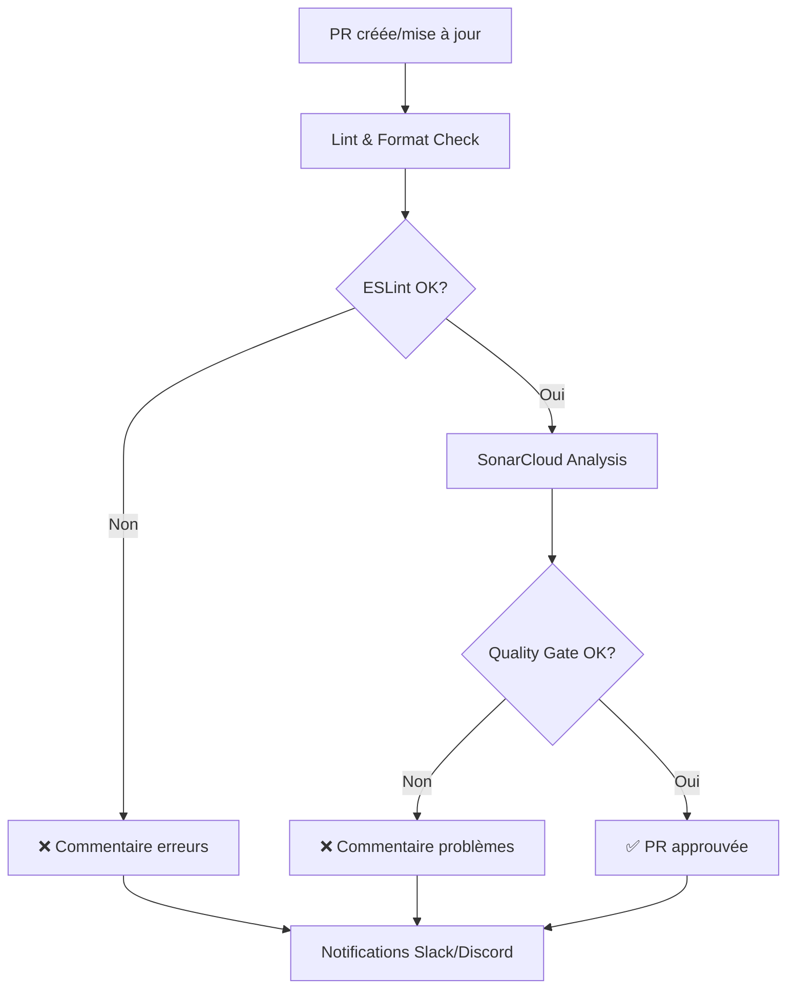

# 🔍 Configuration Code Quality Analysis

Ce guide explique comment configurer l'analyse de qualité de code avec ESLint, Prettier et SonarCloud.

## 🎯 Vue d'ensemble

Le workflow d'analyse de qualité vérifie :

- **ESLint** : Détection d'erreurs et problèmes de code
- **Prettier** : Vérification du formatage du code
- **SonarCloud** : Analyse approfondie (bugs, vulnérabilités, code smells, couverture)
- **Notifications** : Alertes Slack/Discord en cas de problème

## 🚀 Configuration

### 1. Installation des dépendances ESLint

Installez les packages nécessaires pour ESLint :

```bash
npm install --save-dev \
  eslint \
  @typescript-eslint/parser \
  @typescript-eslint/eslint-plugin \
  eslint-plugin-react \
  eslint-plugin-react-hooks \
  eslint-plugin-jsx-a11y
```

### 2. Installation de Prettier

```bash
npm install --save-dev prettier
```

### 3. Ajouter les scripts npm

Ajoutez dans votre `package.json` :

```json
{
  "scripts": {
    "lint": "eslint src --ext .ts,.tsx,.js,.jsx",
    "lint:fix": "eslint src --ext .ts,.tsx,.js,.jsx --fix",
    "format": "prettier --write \"src/**/*.{ts,tsx,js,jsx,json,css}\"",
    "format:check": "prettier --check \"src/**/*.{ts,tsx,js,jsx,json,css}\"",
    "test:coverage": "vitest run --coverage"
  }
}
```

### 4. Configuration SonarCloud

#### Étape 1 : Créer un compte SonarCloud

1. Allez sur [sonarcloud.io](https://sonarcloud.io)
2. Connectez-vous avec votre compte GitHub
3. Cliquez sur **"+"** > **"Analyze new project"**
4. Sélectionnez votre repository GitHub

#### Étape 2 : Obtenir le Token SonarCloud

1. Dans SonarCloud, allez dans **My Account** > **Security**
2. Générez un nouveau token
3. Copiez le token

#### Étape 3 : Configurer GitHub Secrets

Ajoutez les secrets suivants dans **Settings** > **Secrets and variables** > **Actions** :

- `SONAR_TOKEN` : Le token SonarCloud généré

#### Étape 4 : Configurer sonar-project.properties

Éditez le fichier `sonar-project.properties` et remplacez :

```properties
sonar.projectKey=votre-org_votre-repo
sonar.organization=votre-org
sonar.projectName=Votre Nom de Projet
```

Pour trouver ces valeurs :

- `projectKey` et `organization` : Disponibles dans SonarCloud après création du projet
- `projectName` : Le nom affiché dans SonarCloud

### 5. Notifications (optionnel)

Si vous avez déjà configuré Slack/Discord pour d'autres workflows, les notifications fonctionneront automatiquement.

Sinon, référez-vous à `NOTIFICATIONS_SETUP.md` pour configurer :

- `SLACK_WEBHOOK_URL`
- `DISCORD_WEBHOOK_URL`

## 📊 Utilisation

### Exécution automatique

Le workflow s'exécute automatiquement sur chaque **Pull Request** vers `main` ou `develop`.

### Exécution manuelle

```bash
# Linting local
npm run lint

# Fix auto des problèmes ESLint
npm run lint:fix

# Vérifier le formatage
npm run format:check

# Formater automatiquement
npm run format
```

### Exécution dans GitHub Actions

Allez dans **Actions** > **Code Quality Analysis** > **Run workflow**

## 📈 Résultats dans les PR

Le workflow crée deux commentaires automatiques dans chaque PR :

### 1. Commentaire ESLint & Prettier

Affiche :

- Nombre d'erreurs et warnings ESLint
- Top 5 des problèmes ESLint
- Statut du formatage Prettier
- Commandes pour corriger localement

### 2. Commentaire SonarCloud

Affiche :

- Statut du Quality Gate
- Métriques détaillées (bugs, vulnérabilités, code smells)
- Couverture de tests
- Taux de duplication
- Recommandations d'amélioration
- Lien vers le rapport détaillé SonarCloud

## 🎨 Interprétation des résultats

### ESLint

- ✅ **0 erreurs** : Code conforme aux règles
- ⚠️ **Warnings** : Suggestions d'amélioration (n'empêche pas le merge)
- ❌ **Erreurs** : Problèmes critiques (bloque le merge)

### Prettier

- ✅ **Formaté** : Code bien formaté
- ❌ **Non formaté** : Exécutez `npm run format`

### SonarCloud Quality Gate

Critères de passage :

- ✅ **0 bugs** sur nouveau code
- ✅ **0 vulnérabilités** sur nouveau code
- ✅ **Couverture ≥ 80%** sur nouveau code
- ✅ **Duplication ≤ 3%** sur nouveau code
- ✅ **Code smells ratio acceptable**

## 🔧 Personnalisation

### Règles ESLint

Modifiez `.eslintrc.json` pour ajuster les règles :

```json
{
  "rules": {
    "no-console": ["warn", { "allow": ["warn", "error"] }],
    "@typescript-eslint/no-unused-vars": [
      "error",
      {
        "argsIgnorePattern": "^_"
      }
    ]
  }
}
```

### Configuration Prettier

Modifiez `.prettierrc.json` :

```json
{
  "printWidth": 120,
  "tabWidth": 4,
  "singleQuote": false
}
```

### Seuils SonarCloud

Modifiez dans SonarCloud :

1. Allez dans **Project Settings** > **Quality Gate**
2. Créez ou modifiez un Quality Gate personnalisé
3. Ajustez les seuils selon vos besoins

## 🐛 Dépannage

### ESLint échoue avec "Cannot find module"

```bash
# Réinstaller les dépendances
rm -rf node_modules package-lock.json
npm install
```

### SonarCloud ne détecte pas la couverture

1. Vérifiez que `npm run test:coverage` génère `coverage/lcov.info`
2. Vérifiez le chemin dans `sonar-project.properties`
3. Assurez-vous que les tests s'exécutent avant l'analyse SonarCloud

### Le workflow échoue sur "SONAR_TOKEN not found"

1. Vérifiez que le secret `SONAR_TOKEN` est défini dans GitHub
2. Vérifiez que le workflow a les permissions `contents: read`

### Les commentaires n'apparaissent pas dans la PR

1. Vérifiez que le workflow a les permissions `pull-requests: write`
2. Vérifiez les logs du workflow pour voir les erreurs d'API GitHub

## 📚 Ressources

### ESLint

- [ESLint Documentation](https://eslint.org/docs/latest/)
- [TypeScript ESLint](https://typescript-eslint.io/)
- [React ESLint Plugin](https://github.com/jsx-eslint/eslint-plugin-react)

### Prettier

- [Prettier Documentation](https://prettier.io/docs/en/)
- [Options](https://prettier.io/docs/en/options.html)

### SonarCloud

- [SonarCloud Documentation](https://docs.sonarcloud.io/)
- [Quality Gates](https://docs.sonarcloud.io/improving/quality-gates/)
- [GitHub Integration](https://docs.sonarcloud.io/advanced-setup/ci-based-analysis/github-actions-for-sonarcloud/)

## 🎯 Meilleures pratiques

1. **Corrigez les erreurs avant de push** :

   ```bash
   npm run lint:fix && npm run format
   ```

2. **Configurez pre-commit hooks** (optionnel avec Husky) :

   ```bash
   npm install --save-dev husky lint-staged
   npx husky install
   ```

3. **Intégrez dans votre IDE** :
   - VSCode : Extensions ESLint et Prettier
   - Format on save activé

4. **Surveillez les tendances** :
   - Consultez régulièrement le dashboard SonarCloud
   - Objectif : amélioration continue de la qualité

5. **Traitez les warnings** :
   - Les warnings deviennent des erreurs si non traités
   - Planifiez des sprints de clean-up réguliers

## 🔄 Workflow complet



## 💡 Conseils

- **Commencez simple** : Activez progressivement les règles strictes
- **Documentez les exceptions** : Utilisez `// eslint-disable-next-line` avec justification
- **Formez l'équipe** : Sessions de formation sur les règles de qualité
- **Revue régulière** : Adaptez les règles selon les besoins du projet
