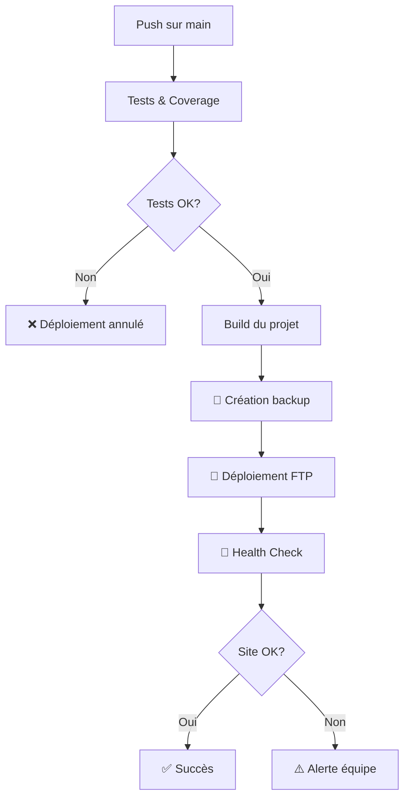

# 🔄 Système de Rollback Automatique

Ce document explique le système de rollback automatique mis en place pour les déploiements sur Hostinger.

## Vue d'ensemble

Le système de rollback automatique protège votre application en production en détectant les problèmes après déploiement et en alertant immédiatement l'équipe.

### Fonctionnalités

✅ **Health Check Post-Déploiement** : Vérifie automatiquement que le site est accessible après chaque déploiement  
✅ **Détection d'Échec** : Identifie si le déploiement a cassé quelque chose  
✅ **Alertes Immédiates** : Notifications Slack/Discord en cas de problème  
✅ **Documentation Automatique** : Rapport détaillé dans GitHub Actions  

## Comment ça fonctionne

### 1. Processus de Déploiement Normal



### 2. Health Check

Après chaque déploiement, le système :

1. **Attend 10 secondes** pour que le déploiement se propage
2. **Teste l'URL** : `https://zawajconnect.me/status`
3. **Vérifie le code HTTP** : Attend un code 200
4. **Génère un rapport** dans GitHub Actions

```bash
# Vérification effectuée
curl -s -o /dev/null -w "%{http_code}" https://zawajconnect.me/status
```

### 3. En Cas d'Échec

Si le health check échoue :

1. ⚠️ **Workflow marqué comme "failed"**
2. 📢 **Notification immédiate** vers Slack/Discord
3. 📋 **Rapport détaillé** dans GitHub Actions avec :
   - Raison de l'échec
   - Site concerné
   - Commit problématique
   - Actions à effectuer
4. 🔍 **Checklist de vérification** pour l'équipe

## Configuration Requise

### 1. Page de Statut

Le système nécessite une page `/status` qui retourne HTTP 200 quand tout va bien.

✅ Déjà implémenté dans `src/pages/Status.tsx`

Cette page vérifie :
- Connectivité Supabase
- Authentification
- API REST
- Stockage

### 2. Secrets GitHub (Optionnels)

Pour recevoir les notifications :

| Secret | Description | Requis |
|--------|-------------|---------|
| `SLACK_WEBHOOK_URL` | URL du webhook Slack | Non |
| `DISCORD_WEBHOOK_URL` | URL du webhook Discord | Non |

**Configuration** : Settings → Secrets and variables → Actions → New repository secret

## Notifications

### Slack

Message envoyé en cas de problème :

```
⚠️ Deployment Health Check Failed - ZawajConnect

Deployment completed but site health check failed

Site: https://zawajconnect.me
Status: https://zawajconnect.me/status
Commit: abc123def
Author: username

⚠️ Manual verification required immediately

[View Workflow]
```

### Discord

Embed similaire avec :
- Titre avec emoji d'avertissement
- Lien vers le site et la page de statut
- Détails du commit
- Lien vers le workflow GitHub Actions

## Que Faire en Cas d'Alerte ?

### Checklist de Vérification

1. **Vérifier l'accessibilité du site**
   - Ouvrir https://zawajconnect.me
   - Tester la navigation

2. **Consulter la page de statut**
   - Ouvrir https://zawajconnect.me/status
   - Vérifier les indicateurs de santé

3. **Vérifier la console navigateur**
   - Ouvrir DevTools (F12)
   - Chercher les erreurs JavaScript

4. **Consulter les logs GitHub Actions**
   - Cliquer sur le lien dans la notification
   - Examiner les logs de déploiement

5. **Vérifier les logs FTP**
   - Dans GitHub Actions, section "Deploy to Hostinger"
   - Chercher les erreurs de transfert

### Actions Possibles

#### Option 1 : Correction Rapide

Si le problème est simple :
1. Corriger le code localement
2. Commit et push sur `main`
3. Le système re-déploiera automatiquement

#### Option 2 : Rollback Manuel

Si nécessaire, revenir à la version précédente :

1. Aller dans GitHub → Actions
2. Trouver le dernier déploiement réussi
3. Cliquer sur "Re-run all jobs"

#### Option 3 : Investigation

Si le problème est complexe :
1. Créer une branche `hotfix/issue-name`
2. Reproduire et corriger localement
3. Tester avec `npm run preview`
4. Merger dans `main` une fois corrigé

## Scripts Disponibles

### Rollback Manuel (Si Nécessaire)

```bash
# Sauvegarder la version actuelle
npm run rollback:backup

# Restaurer une sauvegarde
npm run rollback:restore
```

**Note** : Ces scripts nécessitent accès au terminal et `.ftp-deploy.json`

## Monitoring et Métriques

### Dans GitHub Actions

Chaque déploiement génère un rapport avec :

- ✅/❌ Statut des tests
- 📊 Couverture de code
- 📦 Taille du build
- 🏥 Résultat du health check
- ⏱️ Temps de déploiement

### Historique

Consultez l'historique complet :
- GitHub → Actions → Deploy to Hostinger
- Filtrer par succès/échec
- Comparer les durées

## Limitations Actuelles

### ⚠️ Rollback Automatique Complet

Le système actuel :
- ✅ Détecte les problèmes
- ✅ Alerte l'équipe
- ❌ Ne restaure pas automatiquement les fichiers

**Raison** : L'hébergement mutualisé Hostinger ne permet pas facilement de maintenir plusieurs versions en parallèle via FTP.

**Solution de Contournement** : 
- Les déploiements FTP sont incrémentaux (seuls les fichiers modifiés sont envoyés)
- En cas d'échec du health check, le workflow est marqué comme "failed"
- L'équipe est immédiatement notifiée
- Un re-déploiement de la dernière version stable peut être effectué manuellement

### Améliorations Futures Possibles

1. **Backup Complet FTP**
   - Télécharger l'état actuel avant déploiement
   - Restaurer automatiquement en cas d'échec

2. **Tests E2E Post-Déploiement**
   - Scénarios utilisateur complets
   - Vérification des fonctionnalités critiques

3. **Canary Deployment**
   - Déployer sur un sous-domaine de test d'abord
   - Basculer vers production si tests OK

## Sécurité

### Informations Sensibles

⚠️ **Ne jamais commit** :
- `.ftp-deploy.json`
- Mots de passe FTP
- Tokens d'API

✅ **Toujours utiliser** :
- GitHub Secrets pour les credentials
- Variables d'environnement
- `.gitignore` pour les fichiers sensibles

### Accès aux Notifications

- Limitez l'accès aux webhooks Slack/Discord
- Utilisez des canaux privés
- Restreignez les permissions GitHub Actions

## Support

### En Cas de Problème

1. **Documentation**
   - [GitHub Actions](https://docs.github.com/actions)
   - [Hostinger Support](https://www.hostinger.com/tutorials)

2. **Logs**
   - GitHub Actions → Workflow run → Logs détaillés
   - Hostinger hPanel → File Manager → Logs

3. **Ressources**
   - `GITHUB_ACTIONS_SETUP.md` - Configuration GitHub Actions
   - `HOSTINGER_DEPLOY.md` - Guide de déploiement Hostinger
   - `DEPLOY_NOW.md` - Guide de déploiement général

## Résumé

Le système de rollback automatique offre :

✅ Protection contre les déploiements défectueux  
✅ Détection rapide des problèmes  
✅ Alertes en temps réel  
✅ Documentation automatique  
✅ Processus de récupération clair  

**Rappel Important** : Le système détecte et alerte, mais le rollback complet nécessite une intervention manuelle (re-déploiement d'une version stable via GitHub Actions).
